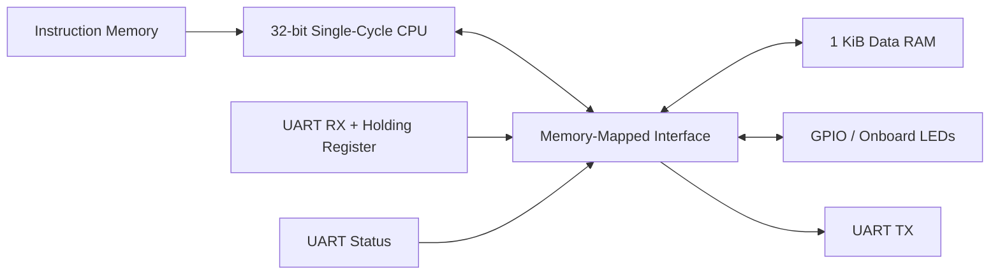

# Tang Nano 9K Custom 32-bit SoC

A resource-conscious FPGA system-on-chip built from scratch in Verilog for the **Tang Nano 9K**. The design combines a custom **32-bit, RISC-V-inspired single-cycle CPU** with memory-mapped RAM, GPIO, and UART peripherals, and is built using an open-source FPGA flow.

> **Status:** Work in progress — CPU/peripheral integration is implemented and the project is currently in SoC-level debugging and hardware bring-up.

## Highlights

- Custom 32-bit single-cycle CPU written in Verilog
- RISC-V-inspired R/I/S/B instruction formats with a custom encoding
- 16 × 32-bit general-purpose register file with `x0` hardwired to zero
- Integer ALU operations including add/subtract, logic, shifts, and signed/unsigned comparisons
- Word load/store and conditional branch datapaths
- Memory-mapped RAM, GPIO, UART TX, UART RX, and UART status registers
- 115200-baud UART designed for the Tang Nano 9K's 27 MHz clock
- Module-level and SoC-level Icarus Verilog testbenches
- Automated Yosys → nextpnr → bitstream → openFPGALoader build/flash flow

## Instruction Set Architecture
```text 
31               20 19     16 15     12 11       8 7      6 5      0
┌──────────────────┬─────────┬─────────┬──────────┬────────┬────────┐
│      ignored     │   rs2   │   rs1   │    rd    │ funct2 │ opcode │ R-type
└──────────────────┴─────────┴─────────┴──────────┴────────┴────────┘

31                         16 15     12 11       8 7      6 5      0
┌────────────────────────────┬─────────┬──────────┬────────┬────────┐
│          imm[15:0]         │   rs1   │    rd    │ funct2 │ opcode │ I-type
└────────────────────────────┴─────────┴──────────┴────────┴────────┘

31               20 19     16 15     12 11       8 7      6 5      0
┌──────────────────┬─────────┬─────────┬──────────┬────────┬────────┐
│     imm[16:5]    │   rs2   │   rs1   │ imm[4:1] │ funct2 │ opcode │ B-type // Implicit 0 for LSB
└──────────────────┴─────────┴─────────┴──────────┴────────┴────────┘

31               20 19     16 15     12 11       8 7      6 5      0
┌──────────────────┬─────────┬─────────┬──────────┬────────┬────────┐
│     imm[15:4]    │   rs2   │   rs1   │ imm[3:0] │ funct2 │ opcode │ S-type
└──────────────────┴─────────┴─────────┴──────────┴────────┴────────┘
```

## Architecture



The CPU exposes a simple address/data/read/write interface to the SoC top level. Address decoding selects RAM or a peripheral, and reads are returned through a shared read-data mux.

## CPU

The processor is a custom educational ISA inspired by RISC-V rather than a binary-compatible RV32I implementation.

### Datapath

- 32-bit program counter
- 32-bit ALU
- 16 general-purpose 32-bit registers
- Two combinational register-file read ports and one synchronous write port
- Immediate-generation unit
- Main control and ALU-control logic
- Single-cycle branch decision and target generation
- External load/store interface for memory-mapped devices

### Instruction classes

| Type | Purpose | Current use |
| --- | --- | --- |
| R-type | Register-register ALU operations | ADD, SUB, XOR, OR, AND, shifts, comparisons |
| I-type | Immediate ALU operations / loads | ALU-immediate operations and `LW` |
| S-type | Stores | `SW` |
| B-type | Conditional control flow | `BEQ` / `BNE` |

The ALU currently defines operations for ADD, SUB, XOR, OR, AND, SLL, SRL, SRA, SLT, and SLTU.

## Memory Map

The intended byte-addressed SoC memory map is:

| Address range / register | Function |
| --- | --- |
| `0x000` – `0x3FC` | 1 KiB data RAM (256 × 32-bit words) |
| `0x400` | GPIO output register |
| `0x404` | UART TX data register |
| `0x408` | UART RX data register |
| `0x40C` | UART status register |

### UART status register

| Bit | Meaning |
| --- | --- |
| 0 | TX active/busy |
| 1 | RX byte ready |

Reading the UART RX register consumes the latched byte and clears the RX-ready flag.

## UART

The project includes custom UART transmitter and receiver modules configured for:

- **Board clock:** 27 MHz
- **Baud rate:** 115200
- **Clock cycles per bit:** approximately 234
- **Frame:** 8 data bits, no parity, 1 stop bit

The RX path double-registers the asynchronous serial input before the receive state machine, then stores completed bytes in a holding register until software reads them.

The current instruction ROM contains a small polling/echo program intended to:

1. Poll the UART status register for `rx_ready`.
2. Read the received byte from `0x408`.
3. Write the byte to `0x404`.
4. Branch back and wait for the next byte.

This end-to-end echo path is currently being debugged at the SoC/hardware level.

UART is verified using picocom and the following command:
```Bash
picocom --baud 115200 --flow none /dev/ttyUSB1
```

## Verification

The repository contains directed testbenches for individual blocks and integrated datapaths, including:

- Register file
- Immediate generator
- CPU ALU path
- Branch/load/store path
- UART TX/RX
- SoC GPIO + UART TX
- SoC UART echo path

Waveforms are dumped to VCD files for inspection with tools such as GTKWave.

Current debugging work includes synchronizing older testbenches with the latest module interfaces and re-validating the complete load/UART path after recent integration changes.

## FPGA Build Flow

`build_flash.sh` automates synthesis through programming:

```text
Verilog RTL
   ↓
YoWASP Yosys
   ↓
nextpnr-himbaechel-gowin
   ↓
gowin_pack
   ↓
openFPGALoader
   ↓
Tang Nano 9K
```

Program volatile SRAM while iterating:

```bash
./build_flash.sh
```

Program persistent flash:

```bash
./build_flash.sh --flash
```

The build targets the Gowin **GW1NR-LV9QN88PC6/I5** device used on the Tang Nano 9K.

## Resource Constraints and Optimization

A major goal of this project is learning how architectural decisions map onto a small FPGA rather than maximizing CPU complexity.

Currently, the design utilizes around 44% of available LUTs on the device (approx 4000). This is due to register file having two write ports, which is unable to be mapped to dedicated BRAM modules. Therefore, the register file is built entirely out of flip-flops and multiplexors.

The current design therefore prioritizes a compact single-cycle SoC with usable peripherals over forcing a larger pipelined processor onto the Tang Nano 9K.

## Current Debugging Priorities

- Re-validate CPU load writeback through the external memory interface
- Verify non-overlapping RAM/peripheral address decoding
- Bring SoC-level testbenches in sync with the latest top-level ports
- Validate UART polling/echo behavior end-to-end
- Confirm GPIO/LED and serial behavior on physical hardware
- Capture final LUT/FF/BRAM utilization and timing results

## Roadmap

After stable hardware bring-up:

- Reduce register-file area or evaluate a synchronous/multi-cycle alternative
- Add a timer peripheral
- Add basic interrupt support if resources permit
- Move test programs out of hardcoded RTL into a cleaner ROM/program-loading flow
- Add automated regression testing for the CPU and SoC
- Document post-synthesis timing and resource tradeoffs

A pipelined CPU may be explored separately in simulation for architecture/performance comparison, but FPGA deployment will remain driven by the Tang Nano 9K's resource limits.

## Repository Layout

```text
.
├── cpu/
│   ├── src/             # CPU RTL
│   ├── testbenches/     # CPU/unit testbenches
│   └── sim/             # Simulation outputs
├── uart/
│   ├── src/             # UART TX/RX RTL
│   └── testbenches/     # UART verification
├── soc_top/
│   ├── soc_top.v        # Memory map + peripheral integration
│   └── *_tb.v           # SoC-level testbenches
├── data_mem.v           # Data RAM
├── tangnano9k.cst       # Tang Nano 9K pin constraints
├── build_flash.sh       # Build and programming script
└── README.md
```

## Tools

- Verilog
- Icarus Verilog
- GTKWave
- YoWASP / Yosys
- nextpnr-himbaechel-gowin
- gowin_pack
- openFPGALoader

## Design Goal

This project is intentionally focused on the complete FPGA development loop: **architecture → RTL → simulation → synthesis → place-and-route → board bring-up → debugging and optimization**.
